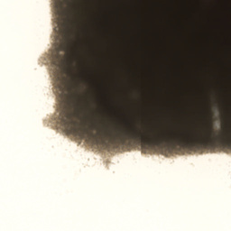

# wsi-tile-cleanup

Simple library for detecting gibberish tiles from histopathological whole-slide images (WSI).

By gibberish tiles, I mean tiles with pen marks and similar artifacts:

   

`wsi_tile_cleanup` detects background tiles (based on the Otsu algorithm), red/blue/green pen marks, and black artifacts.

The typical use case for `wsi_tile_cleanup` is preprocessing whole-slide images (WSI) before loading tiles into a neural network (yes, deep learning). 

## Installation

### Conda

```sh
conda create --name YOUR_ENV_NAME --channel conda-forge libvips pyvips numpy pip
conda activate YOUR_ENV_NAME
pip install git+https://github.com/lucasrla/wsi-tile-cleanup.git
```

### pip or poetry

```sh
# first of all, install libvips with openslide support
# see: https://libvips.github.io/libvips/install.html

# next, create an virtualenv and activate it using your tool of choice

# then, depending on what dependency manager you prefer, run either:
poetry add git+https://github.com/lucasrla/wsi-tile-cleanup.git
# or
pip install git+https://github.com/lucasrla/wsi-tile-cleanup.git
```

## Usage

```python
import wsi_tile_cleanup as cleanup

img = cleanup.read_image("examples/images/tiles/5.jpeg")
bands = cleanup.split_rgb(img)
colors = ["red", "green", "blue"]

for color in colors:
    perc = cleanup.pen_percentage(bands, color)
    print(f"{color}: {perc:.5f}")
```

For more examples, see `examples.py`.


## Credits and Acknowledgments

Please note that this code is just a very thin wrapper around `libvips`, `pyvips` and `numpy`. They are the ones doing the heavy lifting (and doing it amazingly well).

- [libvips](https://libvips.github.io/libvips/): A fast image processing library with low memory needs. Official Python biddings are called [pyvips](https://github.com/libvips/pyvips).

- [NumPy](https://numpy.org): The fundamental package for scientific computing with Python.

- [deep-histopath](https://github.com/CODAIT/deep-histopath): I ported [some of their filters](https://github.com/CODAIT/deep-histopath/blob/master/deephistopath/wsi/filter.py) to `pyvips`. If you are interested in a preprocessing pipeline for deep learning, check out their [nice write-up](https://github.com/CODAIT/deep-histopath/blob/master/docs/wsi-preprocessing-in-python/index.md).

- [scikit-image](https://scikit-image.org): I ported their [implementation of the Otsu algorithm](https://github.com/scikit-image/scikit-image/blob/df84166dfac6ade01d496b7593bb8d36a8d6ad68/skimage/filters/thresholding.py#L237) to `pyvips` and `numpy`.

- [Cancer Digital Slide Archive](https://cancer.digitalslidearchive.org): [TCGA](https://en.wikipedia.org/wiki/The_Cancer_Genome_Atlas) slides hosted online by the [Winship Cancer Institute at Emory University](https://winshipcancer.emory.edu).


## License

`wsi-tile-cleanup` is [Free Software](https://www.gnu.org/philosophy/free-sw.html) distributed under the [GNU General Public License v3.0](https://choosealicense.com/licenses/gpl-3.0/).

Dependencies have their own licenses, check them out.